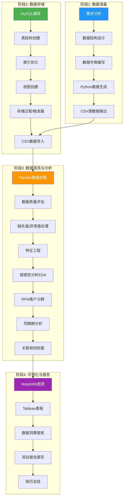

# NovelMart 电商经营分析平台 - 技术路线图

## 项目技术架构总览

```
┌─────────────────────────────────────────────────────────────────────┐
│                    NovelMart 电商经营分析平台                         │
│             NovelMart E-Commerce Business Analytics                   │
└─────────────────────────────────────────────────────────────────────┘
                                   │
        ┌──────────────────────────┼──────────────────────────┐
        ▼                          ▼                          ▼
┌───────────────┐        ┌───────────────┐        ┌───────────────┐
│   数据层       │        │   分析层       │        │   展示层       │
│  Data Layer   │        │ Analysis Layer│        │Presentation   │
└───────────────┘        └───────────────┘        └───────────────┘
        │                          │                          │
   ┌────┴────┐              ┌──────┴──────┐           ┌───────┴───────┐
   │         │              │             │           │               │
   ▼         ▼              ▼             ▼           ▼               ▼
┌──────┐ ┌──────┐    ┌──────────┐ ┌──────────┐ ┌─────────┐   ┌──────────┐
│MySQL │ │ CSV  │    │  NumPy   │ │  Pandas  │ │Tableau  │   │Matplotlib│
│数据库│ │ 文件 │    │ 数值计算 │ │ 数据分析 │ │ 看板    │   │ 图表     │
└──────┘ └──────┘    └──────────┘ └──────────┘ └─────────┘   └──────────┘
```

---

## 技术路线图 (Mermaid)



---

## 详细技术路线

### 阶段1: 数据准备 (Data Preparation)
| 步骤 | 技术 | 工具/库 | 产出 |
|------|------|---------|------|
| 1.1 需求分析 | 业务理解 | - | 分析目标定义 |
| 1.2 数据建模 | ER图设计 | draw.io | 5表关系模型 |
| 1.3 数据字典 | 元数据管理 | Excel/CSV | data_dictionary.csv |
| 1.4 数据集准备 | Python脚本 | NumPy, random | NovelMart 数据集（30万条） |
| 1.5 数据导出 | 文件IO | Pandas to_csv | 5个CSV文件 |

**核心代码**: `data/generate_data.py`
- 使用numpy.random生成符合概率分布的数据
- 使用pandas进行数据聚合和衍生字段计算
- 生成30万+条关联数据记录

---

### 阶段2: 数据存储 (Data Storage)
| 步骤 | 技术 | SQL特性 | 产出 |
|------|------|---------|------|
| 2.1 数据库创建 | DDL | CREATE DATABASE | ecommerce_analysis库 |
| 2.2 表结构创建 | DDL | CREATE TABLE, FK | 5张业务表 |
| 2.3 索引优化 | DDL | CREATE INDEX | 25个索引 |
| 2.4 视图创建 | DDL | CREATE VIEW | 3个分析视图 |
| 2.5 存储过程 | DML | CREATE PROCEDURE | RFM计算过程 |
| 2.6 触发器 | DML | CREATE TRIGGER | 评分自动更新 |
| 2.7 数据导入 | DML | LOAD DATA INFILE | 数据入库 |

**核心代码**: `sql/01_create_database.sql`
- 完整建库建表语句
- 外键约束保证数据完整性
- 覆盖索引优化查询性能
- 视图简化分析查询
- 存储过程实现RFM分析
- 触发器自动维护数据一致性

---

### 阶段3: 数据清洗与分析 (Data Cleaning & Analysis)
| 步骤 | 技术 | 方法 | 关键指标 |
|------|------|------|---------|
| 3.1 数据加载 | Pandas | read_csv | 301,279条记录 |
| 3.2 质量评估 | Pandas | isnull, duplicated | 缺失率, 重复率 |
| 3.3 数据清洗 | Pandas/NumPy | fillna, clip, replace | 清洗后数据量 |
| 3.4 特征工程 | Pandas | cut, get_dummies | 新特征数 |
| 3.5 探索分析 | Pandas/NumPy | groupby, agg, corr | 描述性统计 |
| 3.6 客户分群 | Pandas/NumPy | RFM + 分位数 | 客户群体数 |
| 3.7 同期群分析 | Pandas | pivot_table | 留存率矩阵 |
| 3.8 关联分析 | Pandas | merge, groupby | 商品组合Lift |

**核心代码**:
- `python/01_data_cleaning.py` - 数据清洗流水线
- `python/02_exploratory_analysis.py` - 探索性分析
- `python/03_advanced_analysis.py` - 高级分析

**关键Python技术点**:
```python
# NumPy核心应用
np.random.seed(42)          # 随机种子保证可复现
np.percentile(data, [25,50,75])  # 分位数分析
np.corrcoef(x, y)           # 相关系数矩阵
np.polyfit(x, y, 1)         # 线性回归拟合

# Pandas核心应用
df.groupby('category').agg({...})  # 分组聚合
df.pivot_table(...)                # 透视表
df.rolling(window=7).mean()        # 滚动窗口
df.merge(df2, on='key', how='left') # 多表关联
pd.cut(df['age'], bins=5)          # 离散化分箱
```

---

### 阶段4: 可视化与报告 (Visualization & Reporting)
| 步骤 | 技术 | 工具 | 产出 |
|------|------|------|------|
| 4.1 数据可视化 | Matplotlib | Python | 12张图表PNG |
| 4.2 看板制作 | Tableau | Desktop | 4个交互看板 |
| 4.3 洞察提炼 | 业务分析 | - | 8+条商业洞察 |
| 4.4 报告撰写 | Markdown | 文档 | 项目完整报告 |
| 4.5 简历总结 | - | - | 项目描述段落 |

**核心产出**:
- `python/04_visualizations.py` - 12张专业图表
- `tableau/dashboard_guide.md` - 4个Tableau看板指南
- `docs/project_report.md` - 完整项目报告
- `docs/technical_roadmap.md` - 本文件

---

## 技术栈版本要求

| 技术 | 版本 | 用途 |
|------|------|------|
| Python | >= 3.8 | 数据分析主语言 |
| NumPy | >= 1.20 | 科学计算 |
| Pandas | >= 1.3 | 数据处理 |
| Matplotlib | >= 3.4 | 图表绘制 |
| MySQL | >= 8.0 | 数据库 |
| Tableau | >= 2024.x | 可视化看板 |

---

## 学习路径建议
```
Python基础 → NumPy数组操作 → Pandas数据处理
    → SQL基础(CRUD) → MySQL高级(视图/存储过程/触发器)
        → Matplotlib可视化 → Tableau看板制作
            → 数据分析方法论 → 业务洞察提炼
```

## 项目技能矩阵

| 技能领域 | 具体技能 | 项目中的应用 |
|---------|---------|-------------|
| 数据处理 | Pandas | 30万+条数据清洗、聚合、透视 |
| 数值计算 | NumPy | 统计分析、线性回归、矩阵运算 |
| 数据库 | MySQL | 建库建表、CRUD、视图、存储过程、触发器 |
| 可视化 | Tableau | 4个交互式看板、KPI仪表盘 |
| 可视化 | Matplotlib | 12张专业分析图表 |
| 数据分析 | 方法论 | RFM分析、同期群、关联规则、回归预测 |
| 业务理解 | 电商领域 | GMV、客单价、复购率、用户分群 |
