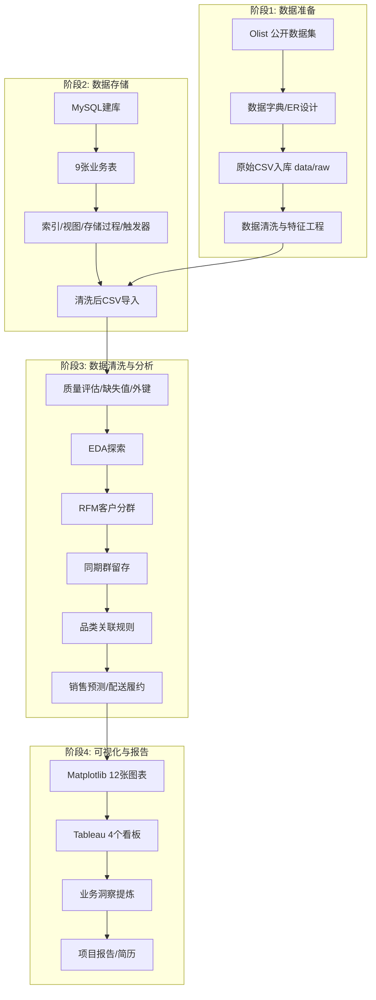

# Olist 电商经营分析平台 - 技术路线图

## 项目技术架构总览

```
┌─────────────────────────────────────────────────────────────────────┐
│                    Olist 电商经营分析平台                             │
└─────────────────────────────────────────────────────────────────────┘
        ┌──────────────────────────┬──────────────────────────┐
        ▼                          ▼                          ▼
┌───────────────┐        ┌───────────────┐        ┌───────────────┐
│   数据层       │        │   分析层       │        │   展示层       │
│  Data Layer   │        │ Analysis Layer│        │Presentation   │
└───────────────┘        └───────────────┘        └───────────────┘
   raw + processed         Pandas / NumPy / SQL      Matplotlib / Tableau
```

---

## 技术路线图 (Mermaid)



---

## 详细技术路线

### 阶段1: 数据准备
| 步骤 | 技术 | 工具/库 | 产出 |
|------|------|---------|------|
| 1.1 数据获取 | Olist 公开数据集 | Kaggle / GitHub | 9 张原始 CSV |
| 1.2 数据建模 | ER 图设计 | Markdown / draw.io | 9 表关系模型 |
| 1.3 数据字典 | 元数据管理 | data_dictionary.csv | 字段级说明 |
| 1.4 数据清洗 | Pandas/NumPy | python/01_data_cleaning.py | data/processed 清洗数据 |

### 阶段2: 数据存储
| 步骤 | 技术 | SQL特性 | 产出 |
|------|------|---------|------|
| 2.1 数据库创建 | DDL | CREATE DATABASE | olist_ecommerce 库 |
| 2.2 表结构创建 | DDL | CREATE TABLE, FK, PK | 9 张业务表 |
| 2.3 索引优化 | DDL | CREATE INDEX | 20+ 索引 |
| 2.4 视图创建 | DDL | CREATE VIEW | 3 个分析视图 |
| 2.5 存储过程 | DML | CREATE PROCEDURE | RFM 计算过程 |
| 2.6 触发器 | DML | CREATE TRIGGER | 评分合法性校验 |
| 2.7 数据导入 | DML | LOAD DATA INFILE | 数据入库 |

### 阶段3: 数据清洗与分析
| 步骤 | 技术 | 方法 | 关键指标 |
|------|------|------|---------|
| 3.1 数据加载 | Pandas | read_csv | 约 55 万条业务记录 |
| 3.2 质量评估 | Pandas | isnull, duplicated | 缺失率、重复率、外键 |
| 3.3 数据清洗 | Pandas/NumPy | fillna, drop_duplicates | 清洗后数据量 |
| 3.4 特征工程 | Pandas | merge, groupby | 订单金额、配送时效、客户聚合 |
| 3.5 探索分析 | Pandas/NumPy | groupby, agg, corr | 描述性统计 |
| 3.6 客户分群 | Pandas/NumPy | RFM + 分位数 | 8 类客户群体 |
| 3.7 同期群分析 | Pandas | pivot_table | 留存率矩阵 |
| 3.8 关联分析 | Pandas | combinations, Counter | 品类组合 Lift |
| 3.9 预测 | Pandas | rolling, ewm | 月度营收预测 |
| 3.10 履约分析 | Pandas | 时间差 | 送达时长、准时率 |

### 阶段4: 可视化与报告
| 步骤 | 技术 | 工具 | 产出 |
|------|------|------|------|
| 4.1 数据可视化 | Matplotlib | Python | 12 张图表 PNG |
| 4.2 看板制作 | Tableau | Desktop/Public | 4 个交互看板 |
| 4.3 洞察提炼 | 业务分析 | - | 8 条商业洞察 |
| 4.4 报告撰写 | Markdown | docs/project_report.md | 完整项目报告 |
| 4.5 简历总结 | - | - | 项目描述段落 |

---

## 技术栈版本要求

| 技术 | 版本 | 用途 |
|------|------|------|
| Python | >= 3.8 | 数据分析主语言 |
| NumPy | >= 1.20 | 科学计算 |
| Pandas | >= 1.3 | 数据处理 |
| Matplotlib | >= 3.4 | 图表绘制 |
| SciPy | >= 1.6 | KDE/统计 |
| MySQL | >= 8.0 | 数据库 |
| Tableau | >= 2024.x | 可视化看板 |

---

## 项目技能矩阵

| 技能领域 | 具体技能 | 项目中的应用 |
|---------|---------|-------------|
| 数据处理 | Pandas | 55 万+ 条记录清洗、聚合、透视 |
| 数值计算 | NumPy | 统计、百分位、相关系数 |
| 数据库 | MySQL | 建库建表、CRUD、视图、存储过程、触发器 |
| 可视化 | Tableau | 4 个交互式看板、地图 |
| 可视化 | Matplotlib | 12 张专业分析图表 |
| 数据分析 | 方法论 | RFM、同期群、关联规则、预测、履约 |
| 业务理解 | 电商领域 | GMV、客单价、复购率、配送时效 |
